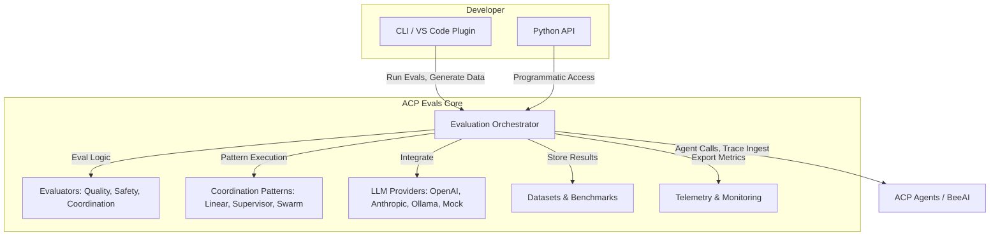

<p align="center">

# ACP Evals

**Open-Source, Research-Driven Evaluation Framework for ACP Agents and Multi-Agent Systems**

<a href="https://www.python.org">
  
</a>
<a href="https://agentcommunicationprotocol.dev">
  
</a>
<a href="https://opensource.org/licenses/Apache-2.0">
  
</a>

<br/>

<a href="./python/docs">Documentation</a> • 
<a href="./python/examples">Examples</a> • 
<a href="#command-line-interface">CLI Reference</a> • 
<a href="./python/CONTRIBUTING.md">Contributing</a>

</p>

---

## Educational Introduction & Value Proposition

Writing evals can be hard and time consuming, especially if you don't know where to start. 

**ACP Evals** is an open-source, production-ready evaluation framework designed for developers building AI agents and multi-agent systems using the [Agent Communication Protocol (ACP)](https://github.com/i-am-bee/acp). It removes the guesswork from experimentation and deployment, providing systematic testing and monitoring capabilities that scale from simple accuracy checks to complex multi-agent coordination analysis.

Agent evaluation involves sending test inputs to your agents and automatically scoring the outputs against expected results. Traditional evaluation tools focus on single AI models, but ACP Evals specializes in the unique challenges of agent systems: measuring how well agents use tools, preserve context across conversations, coordinate with other agents, and maintain performance under production workloads.

You can start with a simple three-line evaluation to test basic functionality, then gradually access more sophisticated features like multi-agent workflow testing, production trace analysis, and continuous monitoring pipelines. Every evaluation automatically tracks token usage and costs across different LLM providers, helping you optimize both quality and efficiency as you scale.

---

## Why ACP Evals?

**Agent evaluation is evolving.**

- Traditional tools focus on single-model accuracy, but modern agent systems demand more:
  - Multi-agent coordination
  - Tool use and context preservation
  - Production-grade reliability and safety
  - Continuous, in-context feedback for developers

**ACP Evals** is built for this new era—drawing on the latest research ([Agent Bricks](https://www.databricks.com/product/artificial-intelligence/agent-bricks), [Loop](https://www.braintrust.dev/docs/guides/loop)), open protocols ([ACP](https://agentcommunicationprotocol.dev), [MCP](https://www.anthropic.com/news/model-context-protocol), [NLIP](https://github.com/nlip-project/documents/blob/main/NLIP%5FSpecification.pdf)), and real-world developer workflows. It's the open-source, extensible backbone for agent reliability, benchmarking, and governance.

---

## Inspired by Leading Research & Protocols

- **Agent Bricks (Databricks):**
  - Auto-synthesized evals, continuous optimization, and Pareto-front cost/quality tradeoffs ([Agent Bricks](https://www.databricks.com/product/artificial-intelligence/agent-bricks), [Introducing Agent Bricks](https://www.databricks.com/blog/introducing-agent-bricks?utm_source=chatgpt.com), [Databricks Launches Agent Bricks](https://www.databricks.com/company/newsroom/press-releases/databricks-launches-agent-bricks-new-approach-building-ai-agents?utm_source=chatgpt.com))
- **Loop (Braintrust):**
  - Inline diff, conversational eval UX, and test-as-you-code feedback ([Loop Docs](https://www.braintrust.dev/docs/guides/loop), [Visualize and interpret evaluations](https://www.braintrust.dev/docs/guides/evals/interpret?utm_source=chatgpt.com))
- **Protocol Foundations:**
  - ACP, MCP, NLIP, and ACDP—standardizing agent communication, discovery, and evaluation ([ACP Discussion](https://github.com/i-am-bee/beeai-platform/discussions/284))

**What's new in ACP Evals?**
- Multi-agent, workflow-level metrics (e.g., MAEBE, TRAIL)
- Production trace recycling and continuous monitoring
- Extensible, developer-first CLI and API
- Native ACP/BeeAI integration

---

## Quick Start

**Minimal Python Example**
```python
from acp_evals import evaluate, AccuracyEval

result = evaluate(
    AccuracyEval(agent="http://localhost:8000/agents/my-agent"),
    input="What is the capital of France?", 
    expected="Paris"
)
print(f"Score: {result.score:.2f}, Tokens: {result.tokens}")
```

**CLI Workflow**
```bash
pip install acp-evals
acp-evals check
acp-evals test http://localhost:8000/agents/my-agent --comprehensive
acp-evals generate tests --scenario qa --count 50 --export tests.jsonl
acp-evals workflow test --pattern supervisor --agents agent1,agent2,agent3
```

---

## Core Features

- **Quality & Performance:**
  - LLM-as-judge scoring, token/cost tracking, latency, groundedness, retrieval metrics
- **Multi-Agent Coordination:**
  - Linear, supervisor, and swarm patterns; handoff quality; workflow-level evaluation
- **Safety & Reliability:**
  - Content filtering, bias/harm checks, adversarial and edge-case testing
- **Production Integration:**
  - Trace recycling, continuous evaluation, OpenTelemetry export, CI/CD hooks
- **Extensible & Modular:**
  - Plug in new evaluators, providers, patterns, and datasets

---

## UX & Workflow Innovations

- **Auto-synthesized edge-case evals** from live logs (cf. Agent Bricks)
- **Inline diff and conversational feedback** (cf. Loop/Braintrust)
- **Design-time, in-context evaluation:**
  - Treat evals like unit tests—see results instantly, fix failures before merge
- **Continuous optimization:**
  - Pareto-front tuning for cost vs. quality, nightly retraining from prod traces

---

## High-Level Architecture



---

## Example: Multi-Agent Evaluation

```python
from acp_evals.patterns import SupervisorPattern
from acp_evals.benchmarks import HandoffBenchmark

pattern = SupervisorPattern(["researcher", "analyzer", "writer"])
benchmark = HandoffBenchmark(pattern=pattern, endpoint="http://localhost:8000")
results = await benchmark.run_batch(
    test_data="coordination_tasks.jsonl",
    parallel=True,
    export="results.json"
)
```

---

## Production & Monitoring

- **Trace recycling:** Convert real user interactions into eval datasets
- **Continuous evaluation:** Automated, scheduled assessments for drift and regression
- **OpenTelemetry export:** Integrate with Jaeger, Phoenix, and other dashboards
- **CI/CD integration:**
  ```bash
  acp-evals test $AGENT_URL --comprehensive --export results.json
  acp-evals report results.json --format markdown > report.md
  ```

---

## Extending ACP Evals

- **Add custom evaluators:** [`python/src/acp_evals/evaluators/`](./python/src/acp_evals/evaluators/)
- **New LLM providers:** [`python/src/acp_evals/providers/`](./python/src/acp_evals/providers/)
- **Coordination patterns:** [`python/src/acp_evals/patterns/`](./python/src/acp_evals/patterns/)
- **Benchmarks/datasets:** [`python/src/acp_evals/benchmarks/datasets/`](./python/src/acp_evals/benchmarks/datasets/)

See [Contributing Guide](./python/CONTRIBUTING.md) for details.

---

## Community & Support

- **Docs:** [API Reference](./python/docs/), [Examples](./python/examples/)
- **Discussions:** [ACP Protocol](https://github.com/i-am-bee/beeai-platform/discussions/284)
- **Contribute:** [CONTRIBUTING.md](./python/CONTRIBUTING.md)
- **Part of [BeeAI](https://github.com/i-am-bee) / [Linux Foundation AI & Data](https://lfaidata.foundation/)**

---

## References & Further Reading

- [Agent Bricks | Databricks](https://www.databricks.com/product/artificial-intelligence/agent-bricks)
- [Introducing Agent Bricks: Auto-Optimized Agents](https://www.databricks.com/blog/introducing-agent-bricks?utm_source=chatgpt.com)
- [Databricks Launches Agent Bricks](https://www.databricks.com/company/newsroom/press-releases/databricks-launches-agent-bricks-new-approach-building-ai-agents?utm_source=chatgpt.com)
- [Loop - Docs - Braintrust](https://www.braintrust.dev/docs/guides/loop)
- [Visualize and interpret evaluations - Braintrust](https://www.braintrust.dev/docs/guides/evals/interpret?utm_source=chatgpt.com)
- [ACP Protocol](https://agentcommunicationprotocol.dev)
- [MCP: Model Context Protocol](https://www.anthropic.com/news/model-context-protocol)
- [NLIP Specification](https://github.com/nlip-project/documents/blob/main/NLIP%5FSpecification.pdf)
- [ACDP: Agent Communication & Discovery Protocol](https://github.com/zerocmd/acdp/blob/main/ACDP.md)

---

## License

Apache License 2.0 – see [LICENSE](./LICENSE).

---

**_ACP Evals: The open, extensible backbone for agent reliability, benchmarking, and governance. Build, test, and ship agents with confidence._**
